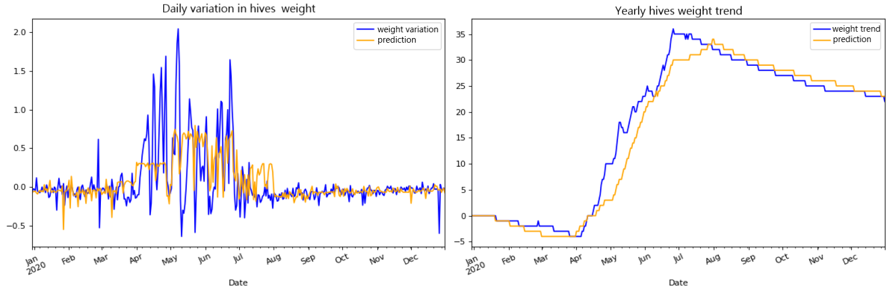

## Selected project in Data Science and Machine Learning

---
### Technology at the service of beekeeping, predictive analysis of honey flow according to meteorological parameters
Modelling of honey production from a hive using meteorological data and beekeeping scales. Training a decision tree as a supervised learning algorithm. Receiving data from [RMI](https://www.meteo.be/en/about-rmi/strategy) and cleaning data from beekeepers' scales. This project was made in collaboration with the [Cari](https://cari.be/-Qui-sommes-nous-.html?lang=fr), a beekeeping research and information center.

   

[Read article](/pdf/204_TECHNOLOGIE.pdf) 

---
### Fraud detection in Delhaize stores
Elaborate a dashboard for fraud detection in the undelivered goods claiming process of stores. This project required to elaborate a dimensional data model and to translate the business's KPI into visualisations. The aim was to accelerate the investigation process on the suspicious stores and to gather more data on actual fraudulent cases. 

   

---
### Recognizoo, application for identifying and collecting personnal information on animals
This project involves training a neural network based on MobileNet architecture to identify an elephent as an individual among its fellow creatures in an animal park. To implement a POC, we collaborated with [Pairi Daiza](https://www.pairidaiza.eu/fr/decouvrir-le-parc), who helped us collect an image database of their elephant family. 

 
  

[View code on Colab](https://colab.research.google.com/drive/1XUHkSbvqFyno_E0IPejy4dIR3VTwnklE#scrollTo=4GwyKWYQvblo)

---
### Object recognition with a humanoid robot
Integrate YOLO V2 into humanoïd robot Pepper for classification and object recognition in real time.

     

[View project presentation on Youtube](https://youtu.be/oR90AfM_8Po)

---
### Rocket landing with reinforcment learning
A PC game in which the player must land a rocket safely on Earth by adjusting the engine's power while ensuring he has enough fuel.  In this project, an agent is trained to play that game by reinforcment learning (Q-Learning) so that he gets a high score. 

 

---
### Other works

- [Blog post : Ethical Analysis of Artificial Super Intelligence](https://ethique.ig.umons.ac.be/posts/2018-2019/D/index.html)
- [Moovic, motion sounding tool for gesture recognition](https://youtu.be/qJFC17VqnXc)
