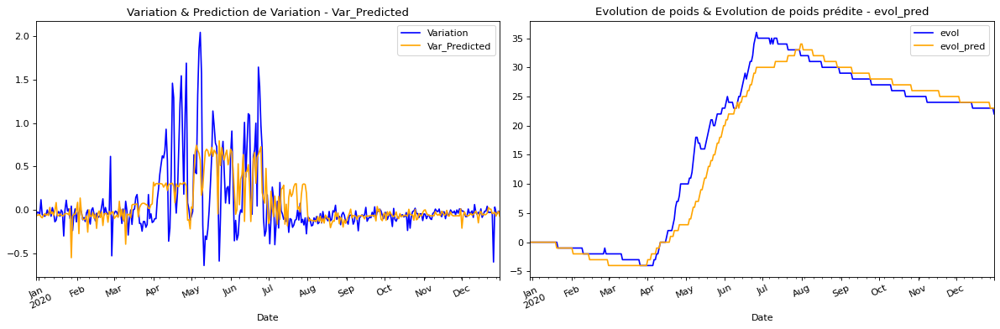

## Selected project in data science and machine learning

---
### [Technology at the service of beekeeping, predictive analysis of honey flow according to meteorological parameters](/pdf/204_TECHNOLOGIE.pdf)
En collaboration avec le [Cari](https://cari.be/-Qui-sommes-nous-.html?lang=fr)
Modélisation de la production de miel d’un rucher selon des données météorologiques et de balances apicoles. Nettoyage, analyse des données et apprentissage supervisé avec un arbre de décision.

---

### [Recognizoo, Outil d’identification d’individus au sein d’un groupe d’animaux](/sample_page)
This project involves training a neural network based on MobileNet architecture to identify an elephent as an individual  among its fellow creatures in an animal park. To implement a POC, we collaborated with [Pairi Daiza](https://www.pairidaiza.eu/fr/decouvrir-le-parc), who helped us collect an image database of their elephant family. 

[View code on Colab](https://colab.research.google.com/drive/1XUHkSbvqFyno_E0IPejy4dIR3VTwnklE?authuser=2#scrollTo=w5lEUuHg5WOr)

---
### [Object recognition with a humanoid robot ](https://youtu.be/oR90AfM_8Po)
Intégration de YOLO V2 pour la classification et la reconnaissance d’objet en temps réel avec un robot Pepper.

---

### Category Name 2

- [Ethic IA](https://ethique.ig.umons.ac.be/posts/2018-2019/D/index.html)
- [Moovic, motion sounding tool for gesture recognition ](https://youtu.be/qJFC17VqnXc)
- [Apprentissage par renforcement pour diriger une fusée dans un jeu](http://example.com/)
A PC game in which the player must land a rocket safely on Earth by adjusting the engine's power while ensuring he has enough fuel.  In this project, I train an agent to play that game by reinforcment learning so that he gets a high score. 
- [Fraud detection in Delhaize stores](http://example.com/)
- [Project 5 Title](http://example.com/)

---

---

Page template forked from <a href="https://github.com/evanca/quick-portfolio">evanca</a>

<!-- Remove above link if you don't want to attibute -->
